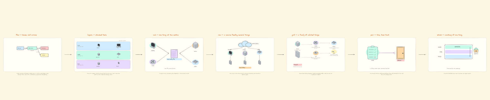
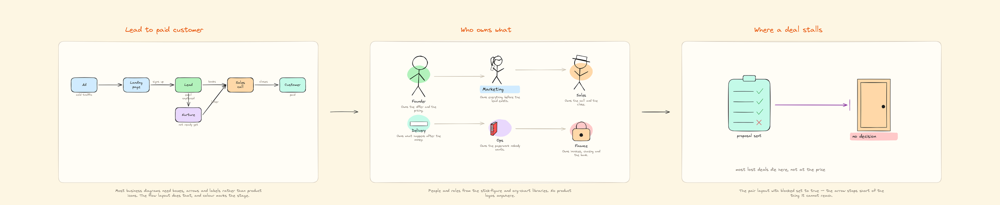
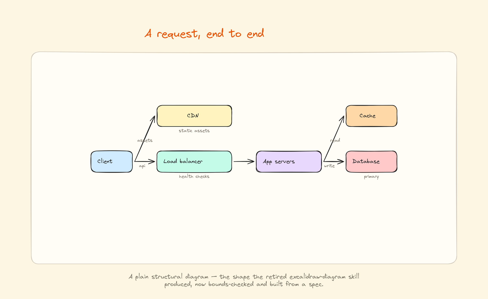
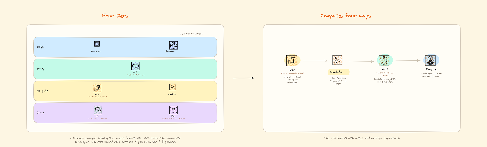

# excalidraw-board

A [Claude Code](https://claude.com/claude-code) skill that turns a JSON spec into
an **editable Excalidraw diagram** — built entirely from free community icon
libraries.

No image model. No API key. No cost. The output is a real `.excalidraw` file, so
every box, arrow and label is still yours to drag around after import.



## Why this exists

Most AI diagram tools hand you a picture. A picture is finished — you cannot fix
the one label that is wrong, or move the box that overlaps.

This produces the file instead. You describe a panel; the layout engine places
it, checks nothing has fallen outside the frame, checks no two labels overlap,
and writes an `.excalidraw` you open on excalidraw.com and edit like anything
you drew yourself.

It rebuilds identically every run, so a board is source you can version rather
than an artefact you regenerate and hope.

## What it does

- **Researches the topic first.** For anything factual it checks current
  sources before drawing, instead of writing the diagram from memory.
- **Finds icons for your subject.** `library.py find <word>` searches icon
  names across every usable community library at once, so you see what exists
  before designing the panels.
- **Eight layouts**, so you describe the shape of the idea rather than placing
  boxes: `flow`, `layers`, `hub`, `row`, `grid`, `pair`, `stack`, `poster`.
- **No coordinates in the spec.** Columns, rows, gaps and wrapping are all
  measured from the content.
- **Auto-fits.** Rows that do not fit close their gaps and then shrink, long
  labels and notes wrap to their column, and boxes grow to hold their text.
- **Checks its own work.** The build fails if any element falls outside its
  panel, or if two pieces of lettering overlap. Both are invisible when you
  look at a whole board zoomed out.
- **Validates the spec first**, with errors you can act on — an unknown layout
  lists the real ones, a missing icon names some that do exist, a bad arrow
  says which node id is wrong.
- **Strips icons that carry their own captions**, so your label is the only one
  on the board.
- **Acronym expansions** in a second colour beneath the label, when you want
  them.
- **PNG export and a shareable link.** Both optional.

## Install

```bash
git clone https://github.com/afrozahmad07/excalidraw-board.git \
  ~/.claude/skills/excalidraw-board
python3 -m pip install pillow
```

That is the whole core dependency. Then ask Claude Code:

> draw me a diagram of how a request reaches my database

Optional extras, only for PNG export and shareable links:

```bash
python3 -m pip install playwright && python3 -m playwright install chromium
```

## Use it directly

```bash
python3 scripts/build.py specs/layouts-tour.json
```

Lands in `boards/` where you ran it.

```bash
python3 scripts/verify_board.py boards/flow-demo.excalidraw   # structure
python3 scripts/export_png.py  boards/flow-demo.excalidraw    # 2x PNG
python3 scripts/share_link.py  boards/flow-demo.excalidraw    # public URL
```

## A spec

No coordinates anywhere. You pick a `layout` and list the content.

```json
{
  "title": "Request path",
  "out": "boards/request-path.excalidraw",
  "panels": [{
    "head": "A request, end to end",
    "layout": "flow",
    "caption": "What happens between the browser and the database.",
    "nodes": [
      {"id": "client", "label": "Client",        "col": 0, "row": 1, "wash": "sky"},
      {"id": "lb",     "label": "Load balancer", "col": 1, "row": 1, "wash": "mint",
       "note": "health checks"},
      {"id": "app",    "label": "App servers",   "col": 2, "row": 1, "wash": "lilac"},
      {"id": "db",     "label": "Database",      "col": 3, "row": 1, "wash": "rose"}
    ],
    "edges": [["client","lb","api"], ["lb","app"], ["app","db","write"]]
  }]
}
```

Eight layouts: `flow` (boxes and arrows), `layers` (stacked tiers), `hub`,
`row`, `grid`, `pair`, `stack`, and `poster` — one rich block with labelled
zones, items placed by relative position, and connectors between them. Several panels in one spec become a story laid
out left to right; one panel is just a diagram.

Full reference in [SKILL.md](SKILL.md).

## Examples

Each was built from the spec beside it. No images generated, nothing paid for.

**Every layout, one panel each** — the picture at the top of this page.
[`specs/layouts-tour.json`](specs/layouts-tour.json)

**A business process** — a funnel, who owns what, and where a deal stalls.
Built from shapes and people, with no product icons anywhere.
[`specs/business-demo.json`](specs/business-demo.json)



**A request, end to end** — the `flow` layout on its own.
[`specs/flow-demo.json`](specs/flow-demo.json)



**Cloud icons** — short AWS and GCP boards showing `layers` and `grid` with
vendor icon sets. [`specs/aws-mini.json`](specs/aws-mini.json) ·
[`specs/gcp-mini.json`](specs/gcp-mini.json)



## Icons

Pulled from [excalidraw.com's 231 community
libraries](https://github.com/excalidraw/excalidraw-libraries), cached locally on
first use.

```bash
python3 scripts/library.py find database    # which icon can I use for X
python3 scripts/library.py search network   # find a whole library
python3 scripts/library.py items <library>  # list what is inside one
```

Registered shorthands cover AWS (249 named icons), Google Cloud (139), Azure
(spread over six libraries), network topology, IT and technology logos, stick
people and figures, office items, org charts and computer parts. Any other
library works too — pass its full `owner/name.excalidrawlib`.

Business and process diagrams usually need none of them. Boxes, arrows, people
and documents carry a funnel, an org chart or an approval flow, and those are
built in — see the business example above.

One rule saves most of the trouble: **if a library's items come back as
`item-0 … item-N`, skip it.** About half the catalogue uses the older format
with unnamed items, and identifying those means rendering each one by hand.

## Licence

MIT. See [LICENSE](LICENSE).
