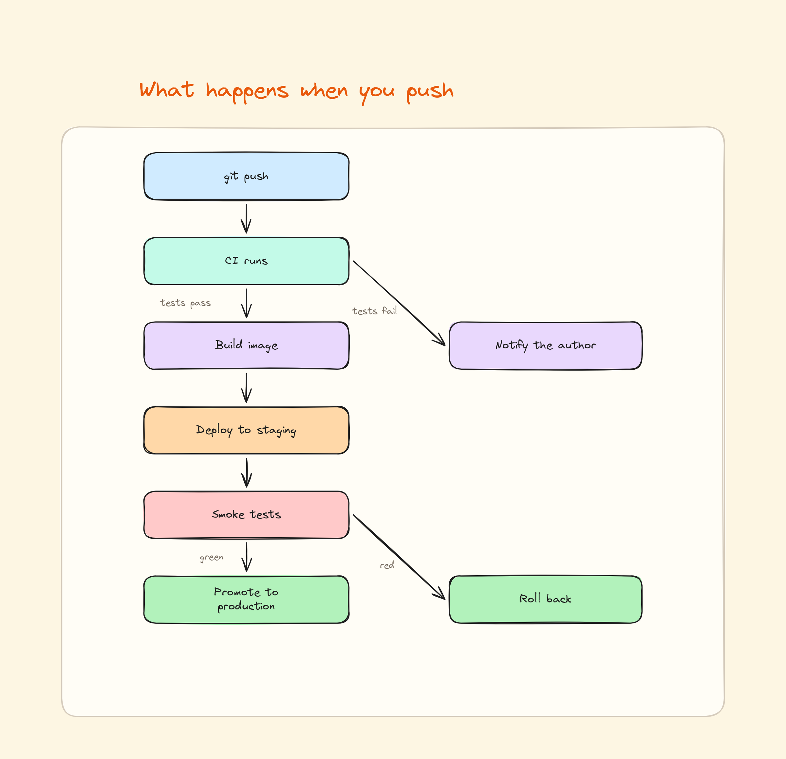
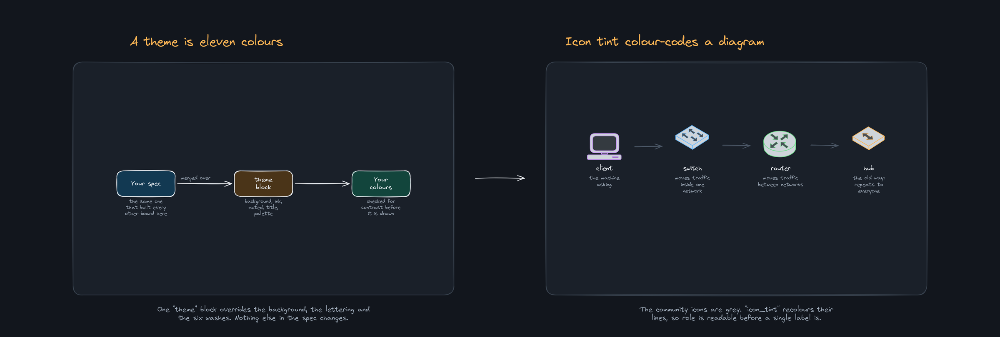

# excalidraw-board

A [Claude Code](https://claude.com/claude-code) skill that turns a JSON spec into
an **editable Excalidraw diagram** — built entirely from free community icon
libraries.

No image model. No API key. No cost. The output is a real `.excalidraw` file, so
every box, arrow and label is still yours to drag around after import.


## Why this exists

Most AI diagram tools hand you a picture. A picture is finished — you cannot fix
the one label that is wrong, or move the box that overlaps.

This produces the file instead. You describe a panel; the layout engine places
it, checks nothing has fallen outside the frame, checks no two labels overlap,
and writes an `.excalidraw` you open on excalidraw.com and edit like anything
you drew yourself.

It rebuilds identically every run, so a board is source you can version rather
than an artefact you regenerate and hope.

## What it does

- **Researches the topic first.** For anything factual it checks current
  sources before drawing, instead of writing the diagram from memory.
- **Asks instead of inventing.** Ask it to draw your team, your setup or your
  onboarding and it asks you for the parts first, rather than making up a
  business you don't have and leaving you to spot every wrong bit. A public
  topic it just researches and draws.
- **Finds icons for your subject.** `library.py find <word>` searches icon
  names across every usable community library at once, so you see what exists
  before designing the panels.
- **Eight layouts**, so you describe the shape of the idea rather than placing
  boxes: `flow`, `layers`, `hub`, `row`, `grid`, `pair`, `stack`, `poster`.
- **No coordinates in the spec.** Columns, rows, gaps and wrapping are all
  measured from the content.
- **Auto-fits.** Rows that do not fit close their gaps and then shrink, long
  labels and notes wrap to their column, and boxes grow to hold their text.
  Icons in a row stand on one baseline, so their labels line up even when one
  icon is three times the height of its neighbour.
- **Checks its own work.** Lettering you cannot see against the colour behind it
  stops the build before a file is written. Elements outside their panel, and
  overlapping lettering, are reported with a non-zero exit — the file is still
  written so you can open it and see. All three are invisible when you look at a
  whole board zoomed out.
- **Validates the spec first**, with errors you can act on — an unknown layout
  lists the real ones, a missing icon names some that do exist, a bad arrow
  says which node id is wrong.
- **Strips icons that carry their own captions**, so your label is the only one
  on the board.
- **Acronym expansions** in a second colour beneath the label, when you want
  them.
- **Imports Mermaid.** Point it at a `.mmd` file, a Markdown fence or stdin and
  get an editable board back. Flowcharts only, and it reports what it dropped.
- **Themeable.** A `theme` block overrides the background, the lettering and the
  six washes, so a board can carry your brand colours or go dark.
- **Colour-codes icons.** `icon_tint` recolours a community icon's lines, so
  role reads before a label does.
- **Previews one panel at a time.** A seven-panel board fits on screen at 14%,
  where every defect disappears. One file per panel, rebuilt through the same
  path as the board itself.
- **PNG export and a shareable link.** Both optional.
- **Tests itself.** `selftest.py` builds every shipped spec, then deliberately
  breaks things to confirm each check still fails.

## Install

```bash
git clone https://github.com/afrozahmad07/excalidraw-board.git \
  ~/.claude/skills/excalidraw-board
python3 -m pip install pillow
```

That is the whole core dependency. Then just ask Claude Code, in plain language:

> make an excalidraw board of who owns what in my business — founder, marketing,
> sales, delivery — use the stick figures

> draw my client onboarding: enquiry, discovery call, proposal, deposit, kickoff

> make an excalidraw poster of how a lead becomes a paying customer, all in one block

> draw where a deal stalls in my sales process: enquiry, demo, proposal,
> negotiation, signed

> draw the steps of buying a house: offer, survey, mortgage, exchange, completion

> make an excalidraw poster of how to plan a holiday, all in one block

> draw me a diagram of how a request reaches my database

> draw how my current setup works end to end: laptop, VPS, Postgres, S3 backups

> draw an AWS diagram — Route 53, CloudFront, load balancer, EC2, RDS

> turn the Mermaid flowchart in my README into an editable Excalidraw board

> redraw that board in our brand colours — dark background, orange headings

You never write the spec yourself. It picks the layout, finds the icons and
writes it.

Optional extras, only for PNG export and shareable links:

```bash
python3 -m pip install playwright && python3 -m playwright install chromium
```

## Use it directly

```bash
python3 scripts/build.py specs/layouts-tour.json
```

Lands in `boards/` where you ran it.

```bash
python3 scripts/preview_panels.py specs/layouts-tour.json     # one file per panel
python3 scripts/selftest.py                                   # is the kit healthy
```

```bash
python3 scripts/verify_board.py boards/flow-demo.excalidraw   # structure
python3 scripts/export_png.py  boards/flow-demo.excalidraw    # 2x PNG
python3 scripts/share_link.py  boards/flow-demo.excalidraw    # public URL
```

## Already have a Mermaid diagram?

```bash
python3 scripts/mermaid_to_spec.py diagram.mmd --build
python3 scripts/mermaid_to_spec.py ARCHITECTURE.md --out specs/arch.json
pbpaste | python3 scripts/mermaid_to_spec.py - --build
```

`flowchart` and `graph`, all four directions. Nodes, edges and edge labels are
carried over, ranked into layers and centred so a parent sits over its children.
The panel is sized from the content, so it lands inside the frame without anyone
guessing at a width.



Any other Mermaid diagram type is **refused by name** rather than half-drawn.
Node shapes, subgraph boxes, dotted links and the second arrowhead on a
bidirectional link do not survive — and each one is reported, so you are never
left comparing by eye.

The result is an ordinary spec. Edit it, add icons and washes, rebuild.

## Your colours

A `theme` block overrides the background, the lettering and the six washes.
Everything is optional and merges over the defaults, so naming one wash leaves
the other five alone.

```json
"theme": {
  "background": "#12161d", "panel": "#1a2029", "ink": "#e9edf2",
  "muted": "#9aa6b4",      "title": "#ffb454",
  "palette": {"mint": "#12453c", "sky": "#123952"},
  "inks":    {"blue": "#66b8ff"}
}
```

`icon_tint` recolours a community icon's lines — `red` `green` `blue` `orange`
`violet` `teal` `grey` `black`, or a `#hex` — so a diagram is colour-coded by
role before a single label is read.



Every colour the spec names is checked before anything is drawn. Lettering you
cannot see against the panel, the wash it sits on, or the canvas **fails the
build**; a wash too pale to notice prints its contrast ratio. That check exists
because `lemon` (`#fff3bf`) scored 1.10 against the panel, was invisible, and
shipped anyway.

It does **not** reach inside the community icons. They keep their own greys, so
on a dark theme give them an `icon_tint` — otherwise they sit at about 2.0
against the panel and the build will not tell you.

Both are in [`specs/theme-demo.json`](specs/theme-demo.json).

## A spec

No coordinates anywhere. You pick a `layout` and list the content.

```json
{
  "title": "Request path",
  "out": "boards/request-path.excalidraw",
  "panels": [{
    "head": "A request, end to end",
    "layout": "flow",
    "caption": "What happens between the browser and the database.",
    "nodes": [
      {"id": "client", "label": "Client",        "col": 0, "row": 1, "wash": "sky"},
      {"id": "lb",     "label": "Load balancer", "col": 1, "row": 1, "wash": "mint",
       "note": "health checks"},
      {"id": "app",    "label": "App servers",   "col": 2, "row": 1, "wash": "lilac"},
      {"id": "db",     "label": "Database",      "col": 3, "row": 1, "wash": "rose"}
    ],
    "edges": [["client","lb","api"], ["lb","app"], ["app","db","write"]]
  }]
}
```

Eight layouts: `flow` (boxes and arrows), `layers` (stacked tiers), `hub`,
`row`, `grid`, `pair`, `stack`, and `poster` — one rich block with labelled
zones, items placed by relative position, and connectors between them. Several panels in one spec become a story laid
out left to right; one panel is just a diagram.

Full reference in [SKILL.md](SKILL.md).

## Examples

Each was built from the spec beside it. No images generated, nothing paid for.

**Every layout, one panel each** — the picture at the top of this page.
[`specs/layouts-tour.json`](specs/layouts-tour.json)

**A business process** — a funnel, who owns what, and where a deal stalls.
Built from shapes and people, with no product icons anywhere.
[`specs/business-demo.json`](specs/business-demo.json)


**A request, end to end** — the `flow` layout on its own.
[`specs/flow-demo.json`](specs/flow-demo.json)


**A dark theme and tinted icons** — the picture further up this page.
[`specs/theme-demo.json`](specs/theme-demo.json)

**Cloud icons** — short AWS and GCP boards showing `layers` and `grid` with
vendor icon sets. [`specs/aws-mini.json`](specs/aws-mini.json) ·
[`specs/gcp-mini.json`](specs/gcp-mini.json)


## Icons

Pulled from [excalidraw.com's 231 community
libraries](https://github.com/excalidraw/excalidraw-libraries), cached locally on
first use.

```bash
python3 scripts/library.py find database    # which icon can I use for X
python3 scripts/library.py search network   # find a whole library
python3 scripts/library.py items <library>  # list what is inside one
```

Registered shorthands cover AWS (249 named icons), Google Cloud (139), Azure
(spread over six libraries), network topology, IT and technology logos, stick
people and figures, office items, org charts and computer parts. Any other
library works too — pass its full `owner/name.excalidrawlib`.

Business and process diagrams usually need none of them. Boxes, arrows, people
and documents carry a funnel, an org chart or an approval flow, and those are
built in — see the business example above.

One rule saves most of the trouble: **if a library's items come back as
`item-0 … item-N`, skip it.** About half the catalogue uses the older format
with unnamed items, and identifying those means rendering each one by hand.

## Licence

MIT. See [LICENSE](LICENSE).
